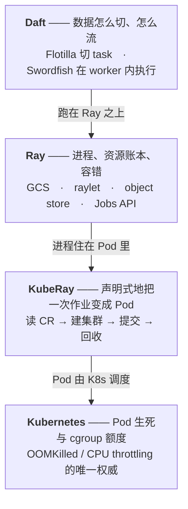
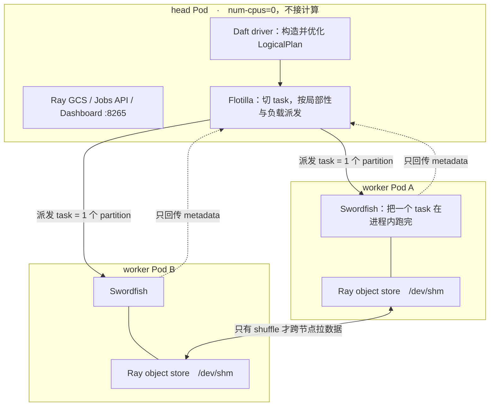

# 架构

这一页只回答一件事：作业在集群上到底怎么跑。后面所有部署约束、调参顺序和内存判断，都从这里推出来。

## 四层各管什么

Kubernetes、KubeRay、Ray、Daft 是四个互不替代的层。分不清谁管什么，排障时就会在错的层上调参。



箭头是"依赖谁"。**排障时反着走**：先确认 Pod 活着，再看 CR 到哪一步，再看 Ray 的 task / actor，最后才怀疑 Daft 的参数。各层的指标与日志出口见[日志与监控](07-observability.md)。

一个直接后果：Daft 侧调参解决不了下面三层的问题。worker Pod 没起来时调 `default_morsel_size` 没有任何意义。

## Flotilla 与 Swordfish

```text
Flotilla    分布式调度层，跑在 head。切分 task，决定派给哪个 worker
Swordfish   单机流式执行引擎（Rust），跑在每个 worker。把一个 task 在机器内部跑完
```

一次 RayJob 跑起来之后，进程拓扑长这样：



图里三件事后面会反复用到：head 上没有计算、数据本体不回 driver、map-only 链路 worker 之间不通信。

- **Native runner** 只有 Swordfish：进程内把计划跑完，没有跨机调度。
- **Ray runner** 是 Flotilla + Swordfish 的嵌套：Flotilla 负责调度，task 落到 worker 之后，执行体仍然是 Swordfish。

因此单机验证出来的内存行为，在集群上依然成立。差异只在调度层：task 怎么切、失败怎么重算、元数据回不回到 driver。

## 三层：Interface → Optimizer → Execution

```text
Interface     DataFrame / SQL，惰性构造 LogicalPlan
Optimizer     谓词下推、列裁剪、Join 重排、UDF 拆分
Execution     把物理计划翻译成 pipeline
```

最下层的形态是 **pipeline，不是 stage**。算子同时驻留，数据在其间流动，不存在"上一阶段全部物化完再进入下一阶段"。后面所有内存判断都以此为前提。

## Swordfish：morsel 驱动的流式执行

数据以 **morsel（行批）** 为单位，由 source 向上推送。

```text
算子之间是有界 async channel
下游背压 → channel 满 → 上游阻塞
```

峰值内存因此与数据总量脱钩，只取决于**同一时刻在途的 morsel**：并发 task 数 × 每 task 在途 morsel 数 × 每行实际大小。数据总量翻十倍，只要同时在处理的量不变，峰值内存可以不变。

`morsel` 配的是**行数，不是字节**。URL 列只有几十字节，下载解码之后可能是几 MB。同一个 morsel 行数在 scan 与 decode 之后可以差三个数量级。`default_morsel_size` 与 `into_batches` 的对比和传播机制见[执行模型](02-execution-model.md)。

## 算子分两类

这是判断"调小 morsel 有没有用"的依据。

### Streaming：来一批走一批，内存不随数据量增长

- `project`
- `filter`
- `explode`
- `unpivot`
- `into_batches`
- UDF（同步、async、vLLM）
- `limit`
- `sample`
- `monotonically_increasing_id`

### Blocking：收齐输入才产出，状态驻留内存

| 类别 | 算子 |
|---|---|
| 聚合 | `aggregate`、`grouped_aggregate`、`pivot`、`distinct` |
| 排序 | `sort`、`top_n` |
| 窗口 | `window`（partition by / order by / frame） |
| 重分区 | `repartition`、`into_partitions` |
| Join | build 侧（构建 probe table） |
| 写出 | `write`、`commit_write` |

`df.explain()` 里出现第二类，状态就会随数据增长，这时调小 morsel 几乎无效——先问能不能换算法、减 key 基数、换 broadcast 或去掉 shuffle，再考虑动参数。

## WriteSink 累积的是什么

`WriteSink` 归类为 blocking sink，但**并不把全量数据攒在内存**。每个 morsel 进来就交给 `AsyncFileWriter` 落盘，按目标文件大小滚动切文件。finalize 阶段只汇总已写文件的元数据（路径、行数、fragment）。

吃内存的是三处：

```text
row group 缓冲     parquet_target_row_group_size，默认 128MB（in-memory 尺度）
同时打开的 writer   partition_cols 每个分区值一个 writer，高基数 = 成倍放大
结果元数据          文件条数 × 每条 stats，最终回到 driver
```

写出侧内存高，先看 `partition_cols` 的基数，再看 row group 目标值。不要把 WriteSink 理解成"全表物化后再写"。参数见[读写参数](06-io-config.md)。

## Flotilla：task = partition，driver 只持有 metadata

Scheduler 按数据局部性和 worker 负载分配 task。**一个 task 对应一个 partition**。Worker Manager 回收 result metadata 与 worker updates。

```text
回到 driver 的是元数据
数据本体留在 worker 的 object store
```

两个直接结论：

1. **partition 数的上限由 driver 决定。** 它管理的 metadata 条数随 partition 增长，与数据体积无关。
2. **每个节点一个 Swordfish worker，不是一核一个进程。** 一核一个时，单个 worker 拿到一批文件必须下载完才能解析、推理，阶段间串行；一节点一个时，I/O 与计算在 worker 内部重叠。

由此推出：**worker pod 应当少而大**。把 64 核拆成 64 个 1 核 pod，会把流水线切碎，I/O 与计算无法重叠。具体规格见[资源与调参](08-tuning-runbook.md)。

## 失败语义：task 级重算

worker 失效后，Flotilla **只重算未完成的 task**。这是 task 粒度的重算，不是作业级 checkpoint。

```text
map-only 链路     已完成 task 通常只回传写出元数据，几乎无中间 partition 留 store → 影响小
有 shuffle 的链路  已完成 task 的产出长期挂在 object store → 节点宕机后下游取不到 → query 失败
```

partition 数因此同时决定三件事：并行度、单 task 的重量、重算粒度。不要把 checkpoint 当成 exactly-once 或作业续传。

## 三条部署硬约束

这三条是 KubeRay / Ray / cgroup 三方行为的交集，不是风格选择。

### 1. head `num-cpus=0`

head 的 CPU 要留给 GCS、Jobs API 和 Flotilla 调度，不能被 UDF actor 抢占。driver 仍运行在 head 上，不设 `entrypointNumCpus` 时不消耗逻辑 CPU。

### 2. `requests == limits`，且 `num-cpus == limits.cpu`

```text
KubeRay 按 limits 上报资源，忽略 memory requests
Ray 调度只读 num-cpus，真正的约束是 cgroup
两者不一致 = 逻辑超卖
```

`num-cpus` 写成 8、`limits.cpu` 写成 4，Ray 会派 8 个逻辑核的任务，cgroup 只会给 4 核，结果就是 throttling 或更糟的排队。

### 3. worker 的内存 limit ≠ 可用于计算的内存

```text
/dev/shm（object store 所在，实际用量计入 limit）
+ Ray 进程
+ 模型 RSS
+ 在途 morsel
共享同一个额度，不可重复扣减
```

内存**不参与调度决策**。Flotilla 按 CPU/GPU 和负载派 task，不判断该节点的内存是否承载得下。余量必须自己留，预算公式见[资源与调参](08-tuning-runbook.md)。

## 四个维度，各管一层

| 维度 | 所在层 | 控制 | 过小 | 过大 |
|---|---|---|---|---|
| **partition** | Flotilla | task 数、并行度、重算粒度 | worker 空闲、单 task 过重 | driver metadata 压力、小文件增多 |
| **morsel** | Swordfish | 单 task 内的在途行批 | 调度与批处理开销上升 | 峰值内存与尾延迟上升 |
| **batch_size** | UDF | 单次推理的样本数 | 模型吞吐不足 | 单批内存峰值上升 |
| **max_concurrency** | UDF | 常驻实例数 / 协程并发 | 资源利用不足 | OOM、排队、下游限流 |

四个维度不直接相乘，它们各自落在三个因子上，真正相乘的是这三个：

```text
在途数据占的内存 ≈ 同时在处理的批数 × 每批行数 × 每行实际大小

同时在处理的批数   每节点并发 task 数（partition 定上限）× UDF 实例数（max_concurrency）
每批行数           min(default_morsel_size, into_batches(n), UDF batch_size)
每行实际大小       download / decode / 推理之后的真实字节
```

`morsel` 与 `batch_size` 同为行数，后者是前者的再切分，因此**取小而不是相乘**。把行数换成字节的是"每行实际大小"，它不由任何参数控制，只能从数据形态估——这也是同一套参数在窄表上没事、在图像链路上 OOM 的原因。

只改其中一个因子、不看乘积，就会出现"我已经把 morsel 调小了还是 OOM"——因为 actor 数或 `download(max_connections=32)` 把并发乘回去了。

## 这一页推出来的结论

1. Native 只验证 Swordfish；生产多机必须用 Ray runner。
2. Worker 少而大，head 不接计算任务。
3. 数据不经过 client / driver，只经过 worker。
4. 写出不是全量物化；高基数 `partition_cols` 比 morsel 更容易把写出内存打爆。
5. `explain()` 里有 blocking 算子时，先改算法，再调 morsel。
