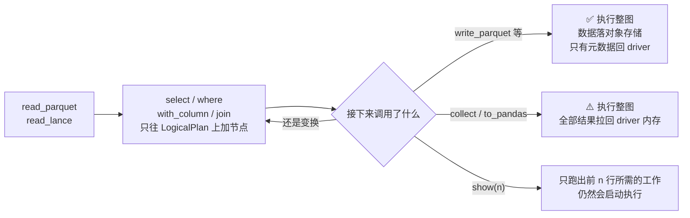
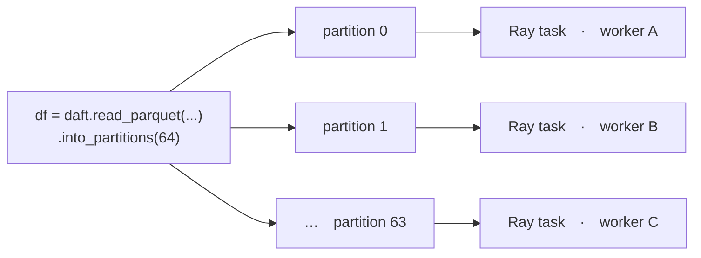
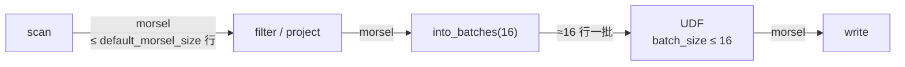

# 执行模型

三件必须先分清的事：什么时候真的开始跑、跑在哪个 runner 上、三层数据单位各管什么。

## 1. 惰性执行与触发点

`select`、`where`、`with_column`、`join`、`groupby` 只构建 LogicalPlan，不读数据、不占 worker。



下列操作会**触发执行**：

| 动作 | 会做什么 | 生产能不能当终点 |
|---|---|---|
| `show(n)` | 只跑出前 `n` 行所需工作 | 可以预览，不能当作业终点 |
| `collect()` | 执行完整计划并物化全部结果 | **大结果禁止** |
| `count_rows()` / `count()` | 跑完整计划只为得到一个数 | 中途当"进度检查"会重跑整图 |
| `to_pydict()` / `to_arrow()` / `to_pandas()` | 把结果拉到调用方进程 | **大结果禁止** |
| `to_torch()` / `to_ray_dataset()` | 物化后交给下游框架 | 确认体积后再用 |
| `write_parquet()` / `write_lance()` / `write_iceberg()` / `write_csv()` / `write_json()` | 执行并把数据落到外部存储 | **生产默认终点** |

不要为了"让前一步先跑"而在每个步骤后调用 `collect()`。这会切断优化机会、增加物化和内存压力。应尽量构建完整计划，最后统一写出。

`show()` 是阻塞的，但只取预览所需结果，不等同于全量 `collect()`。巨大计划上把它当免费探活也不合适——它仍会启动执行。

正式执行前保存计划：

```python
print(df.explain(show_all=True))
```

## 2. Runner 决定执行范围

Runner 必须在应用入口设置一次，并且在创建或执行 DataFrame 前完成。

| Runner | 设置方式 | 适用场景 | 关键限制 |
|---|---|---|---|
| Native | `daft.set_runner_native()` | 单机开发、调试、中小数据 | 没有分布式 partition shuffle；`into_partitions` / `repartition` 基本是 no-op |
| Ray | `daft.set_runner_ray(...)` | 多核、多机、GPU、生产批处理 | 需要匹配的 Ray / Daft / Python 环境 |

```python
import daft

# 生产 RayJob 里 driver 已在集群内，连接本地 Ray 即可
daft.set_runner_ray()

# 交互开发才用 Client；生产长任务不要用
# daft.set_runner_ray("ray://head:10001")
```

也可以用环境变量 `DAFT_RUNNER=native` 或 `DAFT_RUNNER=ray`。`DAFT_RAY_ADDRESS` 已废弃，改用 `RAY_ADDRESS`。

Native 验证的是 Swordfish 的正确性与单机内存行为。它**不能**验证分布式调度、资源约束和故障语义。多节点生产必须用 Ray runner。

## 3. Partition、morsel、batch 各管什么

这三个词最容易混。两张图看清它们的嵌套关系——**partition 是横向的（几个 task 并行），morsel 和 batch 是纵向的（一个 task 内部怎么流）**。先**横向**看并行度：



再把上面 worker B 那个 task 放大，**纵向**看它内部：Swordfish 把数据切成 morsel，一段一段推过算子链，全程不物化整个 partition。



换算关系：

```text
1 个 DataFrame  =  N 个 partition          ← into_partitions(N) / repartition(N)
1 个 partition  =  1 个 Ray task           ← 并行度、重算粒度、写出文件数
1 个 task       =  很多 morsel 依次流过     ← default_morsel_size / into_batches(n)
1 个 morsel     ≥  1 个 UDF batch          ← batch_size 吃不到比上游 morsel 更大的批
```

所以：**加 partition 只让更多 task 并行，不会让单个 task 少占内存**；反过来，压小 morsel 只让单 task 更省，不会提高并行度。峰值内存约等于 `并发 task 数 × 单 task 在途 morsel × 单行体积`，两个方向都得看。

| | Partition | Morsel / batch |
|---|---|---|
| 所在层 | Flotilla（跨 worker） | Swordfish（单 task 内） |
| 是什么 | 一个 Ray task 的工作单元 | 在算子之间流动的行批 |
| 影响 | task 数、并行度、shuffle、重算粒度、写出文件数 | 单次处理开销、峰值内存、UDF 单批大小 |
| 常用 API | `into_partitions(N)`、`repartition(N[, key])` | `default_morsel_size`、`into_batches(n)` |
| Native 上 | 基本 no-op | **有效**，单机也要靠它控内存 |

```python
# Ray 上拆分或合并为目标 partition 数；不按数据量均衡，不做全局 shuffle
df = df.into_partitions(64)

# Ray 上进行随机或按 key 的全局 shuffle
df = df.repartition(64)            # 随机
df = df.repartition(64, "user_id") # 按 key 哈希共址

# 控制后续算子的行批大小
df = df.into_batches(1_000)
```

`into_partitions` 便宜，只做机械拆分 / 合并；`repartition` 贵，走全局 shuffle。只想改 task 数时不要用 `repartition`。partition 的完整决策表、scan 侧切分和起点公式在 [Partition](04-partition.md)。**`into_batches` 在 Ray 上还会重切 partition**，见该页。

## 4. Morsel 与 into_batches

单 task 峰值内存靠这一节。`default_morsel_size` 与 `into_batches` 共用 `MorselSizeRequirement`、单位都是行，但语义不同：

| | `default_morsel_size` | `into_batches(n)` |
|---|---|---|
| 是什么 | execution config 里的一个数 | **计划里的节点**，出现在 `explain()` 里 |
| 注入的要求 | `Flexible(0, N)` | `Flexible(⌊0.8n⌋, n)` |
| 下界 | **0——从不攒批** | **0.8n——攒够才发** |
| 作用范围 | 整条 pipeline 兜底 | 从该节点**向上游**传播，直到 blocking sink |
| Ray 上 | 只影响 task 内部 | **task 边界，会重切 partition** |

想让 scan 少读几行，用 `into_batches`；想给整条链路定保守默认值，才用 `default_morsel_size`。两者都调时取交集。

行批要求从 sink **往上游**递归传播：每个算子 `effective = combine(自己的要求, 下游要求)` 再传给上游；`Strict` 优先，两个 `Flexible` 取区间交集。下界为 0 的算子**从不攒批**——上游给多少就推多少，所以 `into_batches(16)` 之后的 project / UDF 不会把 16 行重新攒回 131072 行。

两条用法推论：

- **`into_batches` 插在膨胀算子之前**（download、decode、explode、模型推理）。插在 decode 之后管不到 decode 本身。
- **要求穿不过 blocking sink**。`sort` / `aggregate` / join build 侧下游的 `into_batches` 管不到它上游的 scan。
- 背靠背两个 `into_batches` 会被优化器折叠，**保留下游那个**。

默认值与生效方式：

```text
default_morsel_size = 131072 行（128 × 1024），单位是行不是字节
```

窄表标量列的默认值。URL、blob、解码图像、embedding 继续用 131072，单批可到数 GB。

**Daft 不读 `DAFT_DEFAULT_MORSEL_SIZE` 环境变量**——`DaftExecutionConfig::from_env` 白名单里没有它，设了不报错、morsel 静默保持 131072。唯一入口：

```python
daft.set_execution_config(default_morsel_size=64)
```

部署 YAML 里设了这个变量却能生效，是因为**应用自己读出来再传** `set_execution_config`。判断有没有用，看入口代码，不看 YAML。

典型用法——全局 morsel 保持吞吐，只在膨胀点前压批：

```python
daft.context.set_execution_config(default_morsel_size=8192)

df = (
    daft.read_parquet("s3://bucket/meta/*.parquet")
    .select("id", "url")
    .into_batches(16)
    .with_column("bytes", daft.col("url").url.download(max_connections=8))
    .with_column("image", daft.col("bytes").image.decode())
)
```

不需要输出顺序时 `maintain_order=False`（也可用环境变量 `DAFT_MAINTAIN_ORDER=false`，在白名单里）。保序会引入排序缓冲。

动态批默认关闭。生产先把静态 morsel 跑稳，再评估 `enable_dynamic_batching`，不要两件事一起开。

四个数字相乘才是在途字节——partition × morsel × UDF `batch_size` × `max_concurrency`。`download(max_connections)` 默认 32 且会顶掉 `S3Config`，见[读写参数](06-io-config.md)。按行形态选起点、何时增减、操作顺序见[资源与调参](08-tuning-runbook.md)。

## 5. 内存由多个资源池共同构成

一次 Daft 作业的峰值内存不只来自 DataFrame：

```text
进程内在途 morsel / batch
+ join / groupby / sort 等 blocking 算子的状态
+ UDF 模型常驻 RSS 和推理临时张量
+ 下载、解压、图像解码后的膨胀数据
+ Parquet row group 和并发 writer 缓冲
+ Ray Object Store（通常 mmap 到 /dev/shm，用量计入 Pod limit）
+ Python / Rust / Ray 系统进程
```

因此，单独增加 partition 或设置 `DAFT_MEMORY_LIMIT` 不能保证避免 OOM。OOM 时先判断是哪一项在涨，再决定该调哪一项。

容器里不设 `DAFT_MEMORY_LIMIT` 时，Daft 可能按**宿主机总内存**做预算。limit 8 GiB、宿主机 256 GiB，引擎会以为自己很宽裕，然后被 cgroup 直接 OOMKilled。

判断 Pod 是否触顶，只认 cgroup working set，不要用容器内 `psutil.virtual_memory()`。各资源池怎么分预算见[资源与调参](08-tuning-runbook.md)。
