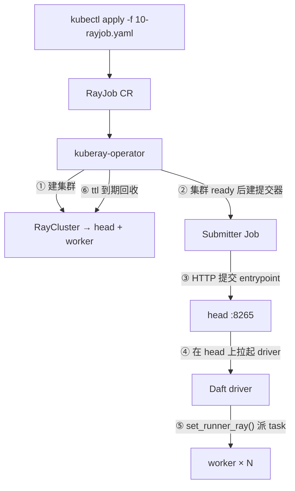

# KubeRay RayJob 部署

生产批处理只用 **RayJob**：一次 CR = 一套集群 + 一次作业 + 跑完回收。本文讲**为什么、YAML 里在配什么、失败了怎么看**；可 apply 的文件以 [`examples/quickstart/`](../examples/quickstart/) 为主线，完整生产参考见 [`examples/kuberay/`](../examples/kuberay/)。

| 阶段 | 目录 | 做什么 |
|---|---|---|
| **验证链路** | [`quickstart/`](../examples/quickstart/) | 3 个 YAML，无 MinIO、无占位符，跑通即证明 KubeRay + RayJob + Daft 可用 |
| **生产参考** | [`kuberay/`](../examples/kuberay/) | 带 MinIO、产物推 S3、调参路径、定时回归 |

基线：KubeRay v1.6.2、Ray 2.55.1。官方对照：[RayJob Quickstart](https://docs.ray.io/en/latest/cluster/kubernetes/getting-started/rayjob-quick-start.html)。

## 为什么不用别的

| 方式 | 生产可用？ | 原因 |
|---|---|---|
| Native runner | 否 | 不能验证分布式调度与 K8s 资源约束 |
| Ray Client `ray://` | **否** | driver 在集群外，长连接一断作业就死。见[生产禁区](09-production-donts.md) |
| 常驻 RayCluster + 手工 `ray job submit` | 调参可以 | 无声明式回收，多作业争资源 |
| **RayJob + `rayClusterSpec`** | **默认** | operator 建集群、提交、跑完删 |
| RayJob + `clusterSelector` | 调参专用 | 集群常驻，见 [`kuberay/`](../examples/kuberay/) 路径 B |

## RayJob 管什么

```text
RayJob CR
  ├─ RayCluster   rayClusterSpec（新建）或 clusterSelector（复用已有）
  └─ Submitter    一个 K8s Job，跑 ray job submit --address ... -- $entrypoint
```



**第 ④ 步是关键**：driver 在 **head Pod** 里，不在 submitter 里。submitter 只发起 HTTP 提交并 tail 日志，它挂掉不会带走作业。

三个不要混的词：

| 词 | 是什么 |
|---|---|
| **RayJob** | KubeRay 的 CRD |
| **Ray job** | 提交到集群上的那份作业 |
| **Submitter** | 跑 `ray job submit` 的 K8s Job |

Quickstart 用默认 submitter 即可（无外部依赖要探）。`examples/kuberay/20-rayjob.yaml` 才自定义 `submitterPodTemplate` 插 `wait-deps`。

## 步骤 0 · 装 Operator

```bash
helm repo add kuberay https://ray-project.github.io/kuberay-helm/
helm install kuberay-operator kuberay/kuberay-operator -n kuberay-system --create-namespace

kubectl get crd | grep ray.io
kubectl -n kuberay-system rollout status deploy/kuberay-operator
```

Operator 没起来时 RayJob 能创建但**永远不产生 Pod**。先看 operator 日志，不要先调 Daft 参数。

## 步骤 1 · 构建并导入镜像

Quickstart 用 [`examples/docker/`](../examples/docker/) 的 `daft-ray-ops:2.55.1`——Ray 基础镜像 + Daft 锁版本 + 排障 CLI，**运行期不 pip/uv**。

```bash
cd examples/docker && bash build.sh
# k3s 节点：Docker 里的镜像 k3s 用不了，必须导入
bash import-to-k3s.sh daft-ray-ops:2.55.1
```

**Daft 没有官方镜像。** 官方 Helm chart 用 `rayproject/ray` + `runtime_env={"pip": ["daft"]}`，离线不可用、版本不锁、且常走 Ray Client。详见 `examples/quickstart/README.md`。

`rayVersion` 必须和镜像里的 Ray 一致（**2.55.1**）。head、worker、submitter 必须同一不可变 tag。

## 步骤 2 · apply Quickstart

```bash
cd examples/quickstart
kubectl apply -f 00-configmap-script.yaml    # namespace + main.py
kubectl apply -f 10-rayjob.yaml              # 4GB VM 换 10-rayjob-smoke.yaml
```

三个文件各管什么：

| 文件 | 作用 |
|---|---|
| `00-configmap-script.yaml` | namespace `daft-quickstart` + 示例 `main.py`（`set_runner_ray()` + 6 行 `collect()`） |
| `10-rayjob.yaml` | RayJob + 临时集群（head 2Gi，worker 2C·4Gi，1 副本） |
| `10-rayjob-smoke.yaml` | 同上，缩到 4GB/2CPU 虚拟机可跑 |

`entrypoint` 就是一行：

```yaml
entrypoint: python /home/ray/samples/main.py
```

脚本通过 ConfigMap 挂到 `/home/ray/samples/`。ConfigMap 的 key **没有执行位**，所以必须写 `python /path/...`，不能裸写路径。

## 步骤 3 · 核对结果

```bash
kubectl get rayjob daft-quickstart -n daft-quickstart -w
kubectl logs -n daft-quickstart -l job-name=daft-quickstart -f
```

两个状态字段含义不同，**都要看**：

| 字段 | 谁的状态 | 成功值 |
|---|---|---|
| `jobStatus` | Ray job（作业进程） | `SUCCEEDED` |
| `jobDeploymentStatus` | KubeRay 对这次提交的部署 | `Complete` |

日志里应看到按 `a` 排序、`b=true` 的三行表格。失败时查 reason：

```bash
kubectl get rayjob daft-quickstart -n daft-quickstart \
  -o jsonpath='{.status.reason}{"\n"}{.status.message}{"\n"}'
```

| reason | 含义 | 常见原因 |
|---|---|---|
| `PreRunningDeadlineExceeded` | 集群没在 `preRunningDeadlineSeconds` 内 ready | 镜像拉不动、内存不够、探针过早 |
| `SubmissionFailed` | 提交器 Pod 失败 | submitter 日志 |
| `DeadlineExceeded` | 撞 `activeDeadlineSeconds` | 作业或拉起超时 |
| `AppFailed` | 集群正常，作业自己失败 | driver / worker 日志 |
| `ValidationFailed` | spec 非法 | operator 没动手 |

确认 Ray 看到预期 CPU：

```bash
HEAD=$(kubectl get pod -n daft-quickstart -l ray.io/node-type=head -o jsonpath='{.items[0].metadata.name}')
kubectl exec -n daft-quickstart -c ray-head "$HEAD" -- ray status
```

日志与排障命令见[日志与监控](07-observability.md)。调参见[资源与调参](08-tuning-runbook.md)。

## Quickstart YAML 里值得记住的字段

以 `examples/quickstart/10-rayjob.yaml` 为准：

```yaml
spec:
  shutdownAfterJobFinishes: true      # 跑完删集群
  ttlSecondsAfterFinished: 60         # 留 60s 捞日志；>0 必须配 shutdownAfterJobFinishes
  activeDeadlineSeconds: 300          # 整次 RayJob 硬超时（含拉起）
  preRunningDeadlineSeconds: 300      # 集群拉不齐时快速失败
  submissionMode: K8sJobMode          # 默认；多一个 submitter Pod，日志在 kubectl logs 里
  backoffLimit: 0                     # 重试 = 新建整集群重跑，示例不要自动重试

  rayClusterSpec:
    headGroupSpec:
      rayStartParams:
        num-cpus: "0"                 # head 不接计算 task
      template:
        spec:
          containers:
            - resources:
                requests: { cpu: "1", memory: "2Gi" }
                limits:   { cpu: "1", memory: "2Gi" }   # KubeRay 按 limits 上报，request==limit
    workerGroupSpecs:
      - replicas: 1
        rayStartParams:
          num-cpus: "2"               # 必须等于 limits.cpu
```

**小内存节点**（4GB VM）换 `10-rayjob-smoke.yaml`，三处额外让步：

1. `object-store-memory: "78643200"`（Ray 下限 75Mi，不设可能直接退出）
2. 手动限制 `/dev/shm`（KubeRay 默认按 memory limit 给，会把 head 挤爆）
3. 探针和 `activeDeadlineSeconds` 放宽到 900s（拉起慢，别过早判失败）

k3s 还要把 Docker 镜像导入 containerd，见 `examples/quickstart/README.md`。

## 作业入口该长什么样

Quickstart 的 `main.py` 用 `collect()` 只为看见输出（6 行数据）。**生产必须以 `write_*` 收尾**：

```python
import daft

daft.set_runner_ray()                          # driver 已在 head 内，不用传 address
daft.set_execution_config(default_morsel_size=8192, maintain_order=False)

df = daft.read_parquet("s3://bucket/in/*.parquet")
df = df.into_partitions(64).with_column(...)
df.write_lance("s3://bucket/out.lance", mode="overwrite")   # 不是 collect()
```

不要：`collect()` 大结果、`ray://` Client、`set_runner_native()`。理由见[生产禁区](09-production-donts.md)。

环境变量 `DAFT_DEFAULT_MORSEL_SIZE` 只有应用自己读出来再传给 `set_execution_config` 才生效——Daft 不读这个变量。见[执行模型](02-execution-model.md)。

## 重跑与清理

RayJob 是**一次性**对象。对已 `Complete` 的 CR 再 `apply` **不会重跑**：

```bash
kubectl delete rayjob daft-quickstart -n daft-quickstart --ignore-not-found
kubectl apply -f 10-rayjob.yaml
```

清理：

```bash
kubectl delete rayjob daft-quickstart -n daft-quickstart --ignore-not-found
kubectl delete -f 00-configmap-script.yaml --ignore-not-found
```

## 往生产走 · [`examples/kuberay/`](../examples/kuberay/)

Quickstart 验证通过后，同一套 RayJob 形态可以扩到真实流水线。生产目录在 Quickstart 之上加了：

| 能力 | 文件 | 和 Quickstart 的差别 |
|---|---|---|
| 平台依赖（MinIO、脚本 ConfigMap） | `00-platform.yaml` | 有外部依赖 → 自定义 submitter 探活 |
| 生产批处理 | `20-rayjob.yaml` | 10 worker、产物推 S3、`run-bench.sh` 包装 |
| 定时回归 | `30-raycronjob.yaml` | `jobTemplate` 复用 RayJob spec |
| 调参留现场 | `40-raycluster.yaml` + `41-rayjob-existing.yaml` | `clusterSelector` 代替 `rayClusterSpec` |

**不要同时 apply `20-rayjob.yaml` 和 `40-raycluster.yaml`**——两份 CR 抢同一批节点。

路径 B（常驻集群）有三条硬约束：`shutdownAfterJobFinishes` 静默忽略、`backoffLimit` 只能是 0、`SidecarMode` 不可用。字段对照、产物推送、占位符修改步骤见 `examples/kuberay/README.md`。
