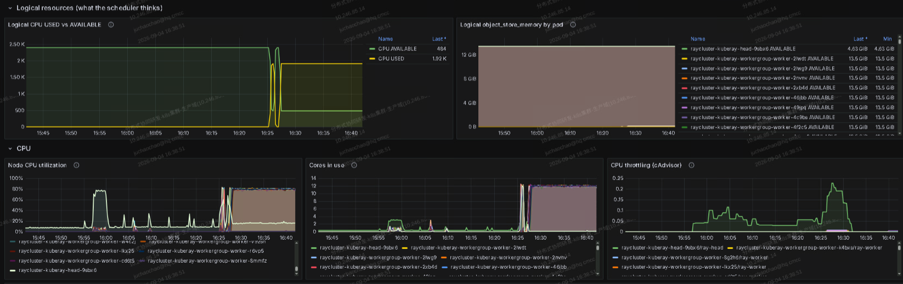
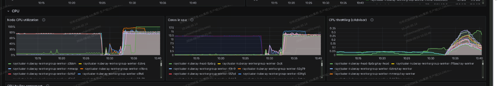
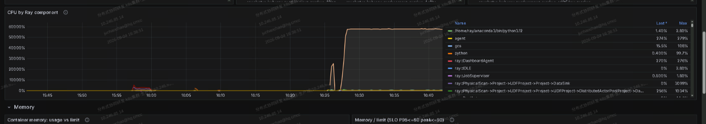
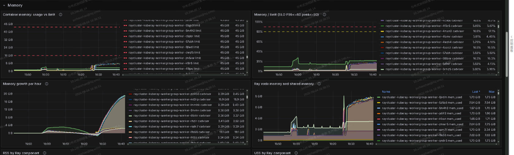
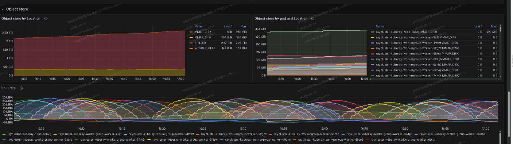

# 日志与监控

这一页只回答两件事：**失败了日志去哪找**，**Grafana 里该盯哪几条线**。PodMonitor、Fluent Bit、Helm 接入是平台侧工作，文末留一段索引，不在这里展开。

排障顺序永远是自下而上：**K8s → KubeRay → Ray → Daft**。下层没起来，上层指标不会产生。

| 层 | 回答什么 | 日常入口 |
|---|---|---|
| **K8s** | Pod 活着吗、OOMKilled 了吗、CPU 被限流了吗 | `kubectl describe pod`、`container_memory_working_set_bytes` |
| **KubeRay** | CR 进到哪一步 | `kubectl get rayjob -o yaml`、operator 日志 |
| **Ray** | task / actor、object store、spill | Dashboard `:8265`、`ray_*` 指标、`/tmp/ray/.../logs/` |
| **Daft** | 算子行数、task 终态 | OTLP 指标、Daft Dashboard `:3238` |

```text
kubectl logs          → 只有容器 stdout
ray job logs          → driver 全量，日常首选
exec /tmp/ray/...     → UDF / worker 内部报错通常只在这里
```

Ray 的文件日志在 `/tmp/ray/session_latest/logs/`，**`kubectl logs` 看不到**。Pod 被 TTL 回收或 `delete` 之后，2～4 类日志一起消失——所以失败时**先别删 Pod**，用下面命令把现场带走。长期留存交给平台（sidecar / 日志系统），见[生产禁区](09-production-donts.md) #33。

## 失败之后怎么做

先锁定层次，再下钻日志：

```bash
kubectl -n "$NS" get pods,jobs,rayjobs,rayclusters
kubectl -n "$NS" describe pod "$POD"   # OOMKilled / Pending 原因
kubectl -n "$NS" get rayjob "$NAME" \
  -o jsonpath='{.status.jobDeploymentStatus}{"\n"}{.status.jobStatus}{"\n"}'
kubectl -n "$NS" exec -c ray-head "$HEAD" -- ray job status "$JOB_ID"
kubectl -n "$NS" exec -c ray-head "$HEAD" -- \
  ray list actors --address http://127.0.0.1:8265
```

| 形态 | 典型证据 | 日志去哪找 |
|---|---|---|
| Pod 起不来 | Pending / ImagePullBackOff | `describe pod` 的 Events |
| driver 失败 | `ray job status` = FAILED | `ray job logs` 或 `job-driver-<sid>.log` |
| worker / actor 被杀 | 退出码 137，`RESTARTING` | worker 上 `worker-*.err`、`python-core-worker-*.log` |

```text
137  SIGKILL（OOM）—— cgroup 或 Ray memory monitor
139  段错误（原生库与镜像不匹配）
```

被杀进程的日志通常在 **worker** 的 `/tmp/ray` 里，不要只拷 head。RayJob `.status.reason` 对照表见 [KubeRay RayJob 部署](03-deploy-kuberay.md)。

## 常用查看命令

```bash
# driver（最常用）
kubectl -n "$NS" exec -c ray-head "$HEAD" -- \
  ray job logs --address http://127.0.0.1:8265 "$JOB_ID" | tail -200

# Dashboard
kubectl -n "$NS" port-forward svc/daft-head-svc 8265:8265
# → http://127.0.0.1:8265  Jobs / Logs / Metrics

# worker 内部搜异常
kubectl -n "$NS" exec -c ray-worker "$W" -- \
  sh -c 'grep -rlE "Traceback|Error|Killed" /tmp/ray/session_latest/logs | head'

# 列出日志目录
kubectl -n "$NS" exec -c ray-head "$HEAD" -- \
  ls -lt /tmp/ray/session_latest/logs | head
```

值得记住的文件名：

| 文件 | 什么时候看 |
|---|---|
| `job-driver-<submission_id>.log` | driver 失败，第一个看 |
| `worker-*.err` | UDF 抛错、模型加载失败 |
| `python-core-worker-*.log` | 进程被杀、段错误 |
| `gcs_server.*` | 控制面异常（仅 head） |
| `runtime_env_setup-*.log` | pip / 依赖装包失败 |

## 指标：先盯这些

容器内 `psutil.virtual_memory()` 读到的通常是宿主机视角，**不能**用于 Pod SLO。判断触顶只认 cgroup working set：

```promql
container_memory_working_set_bytes{namespace="$NS",container="ray-worker"}
/ on(pod) container_spec_memory_limit_bytes{namespace="$NS",container="ray-worker"}
```

| 问题 | 指标 | 怎么读 |
|---|---|---|
| Pod 被内核杀 | `kube_pod_container_status_last_terminated_reason` | `OOMKilled` |
| CPU 莫名变慢 | `container_cpu_cfs_throttled_seconds_total` | throttling 抬头 = limit 掐住 |
| 并行度封顶 | `ray_resources{Name="CPU",State}` | USED 贴 AVAILABLE 平顶 |
| actor 反复初始化 | `ray_actors{State="RESTARTING"}` | 上升 = 被杀后重做 |
| 对象存储打盘 | `ray_object_store_memory{Location="SPILLED"}` | 离开 0 必须处理 |
| Ray 软驱逐 | `ray_memory_manager_worker_eviction_total` | 关 memory monitor 只会变成硬 OOM |

`ray_tasks` / `ray_actors` 必须 `sum(...) by (Name, State)`，单条序列含负值点，单独看没意义。

Ray 2.53 起默认不导出 `WorkerId` 标签；需要时设 `RAY_metric_cardinality_level=legacy`。

## 这些指标画出来长什么样

五张来自一次真实作业的 Ray 看板截图（JSON 在 head Pod 的 `/tmp/ray/session_latest/metrics/grafana/dashboards/`）。让上表的指标名和实际曲线对上号。

**逻辑资源：调度器以为的世界**



USED 顶到 AVAILABLE 走平顶 → 并行度被逻辑 CPU 封顶，加 partition 不会更快，要加 worker。这是**调度账本，不是真实占用**。

**CPU：真实利用率与 throttling**



最右侧 throttling 最容易漏：逻辑 CPU 有余量但 throttling 抬头 → cgroup limit 掐住，症状是变慢不是报错。

**CPU by Ray component**



UDF 占大头 → 调 [UDF](05-udf.md)；`gcs` / `dashboard` 占大头 → 检查是否把计算派到了 head。

**内存**



usage vs limit 判 OOM 风险；growth per hour 持续爬坡 → 某处在攒数据。`/dev/shm` 单列，不能和堆混在一起算。

**Object store 与 spilling**



`SPILLED` 离开 0 → 开始打盘，吞吐会掉。处理顺序见[资源与调参](08-tuning-runbook.md)。

## Daft 指标与 Dashboard

Daft **不开 `/metrics` pull 端口**，设 OTLP endpoint 才会往外推：

```bash
export OTEL_EXPORTER_OTLP_PROTOCOL=http/protobuf
export OTEL_EXPORTER_OTLP_METRICS_ENDPOINT=http://prometheus:9090/api/v1/otlp/v1/metrics
export OTEL_METRIC_EXPORT_INTERVAL=10000          # 默认 500ms 太激进
export OTEL_SERVICE_NAME=daft-ray-driver          # driver / worker 分开命名
```

| 指标 | 含义 |
|---|---|
| `daft.rows.in` / `daft.rows.out` | 算子消费 / 产出行数 |
| `daft.bytes.read` | scan 读入字节（Ray） |
| `daft.task.failed` / `.cancelled` | task 终态（Ray） |
| `checkpoint.keys_staged` / `.sealed` | 续跑；staged 涨、sealed 为 0 = 没生效 |

内网 / 离线设 `DAFT_ANALYTICS_ENABLED=0`。

两个 UI 不互相替代：

| 端口 | 看什么 |
|---:|---|
| **8265** | Ray：Jobs / Actors / Logs / `ray_*` |
| **3238** | Daft：查询计划、算子进度（独立 Deployment，别塞进 head——RayJob 回收后历史就没了） |

## 平台接入（交给运维）

默认 Helm / quickstart **不会**自动接通完整观测栈。平台团队按需补：

- Ray head/worker 的 PodMonitor（head 还要 44217 / 44227，worker 只抓 8080）
- KubeRay operator ServiceMonitor（`metrics.serviceMonitor.enabled=true`）
- Daft OTLP → Collector / Prometheus
- `/tmp/ray` 日志 sidecar（Fluent Bit 等）

细节见 [Ray monitoring](https://docs.ray.io/en/latest/cluster/metrics.html)、[KubeRay monitoring](https://ray-project.github.io/kuberay/guidance/prometheus-grafana/)。指标看出问题之后该调哪一项，见[资源与调参](08-tuning-runbook.md)。
